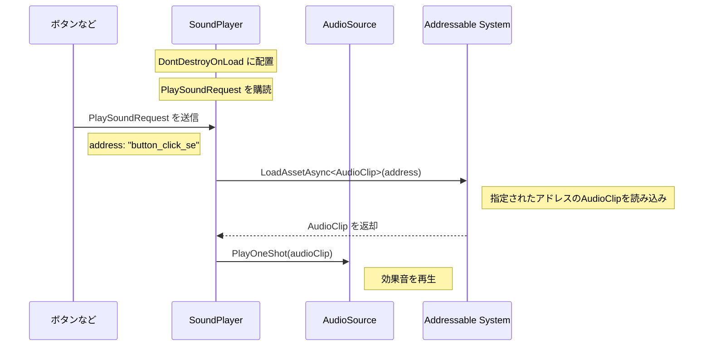

# オレオレ SE プレイヤー

汎用的なものが出来たと思ったので覚え書き。

## 実現したかったこと

- SE（効果音）の再生に関する機能（音量調整など）を一元管理すること。
- シーン切り替え時に効果音が途切れないこと。
- `.Play()` を複数個所にハードコードしないこと。

```csharp

```

## 環境

- Unity 6000.
- MessagePipe
  - 効果音の再生リクエストの送受信に使用します。
- Addressable
  - 効果音を登録します。
- s
  - DontDestroyOnLoad に配置するために使用しました。
  - DI コンテナは必須ではありません。（手動で DontDestroyOnLoad に配置してもよい）

## 処理イメージ



## 具体的な実装

実装するクラスは以下のとおりです。

- `SoundPlayer`クラス
  - MonoBehavioir を継承します。
  - DontDestroyOnLoad に配置します。
    - そうすることにより、シーン横断時に再生した音が途切れないようにできます。
- `PlaySoundRequest`クラス
  - MessagePipe で送受信するメッセージクラスです。
  - Addresable に登録した効果音のアドレスを保持します。
  - イミュータブルだと嬉しい。
    - 今回は `record` で定義しましたが、`readonly struct` などでも代替可能のはずです。お好みで。
- ボタンなど
  - 効果音を再生したいタイミングで、`PlaySoundRequest`を送信します。

### SoundPlayer クラス

```csharp

```

### PlaySoundRequest クラス

```csharp

```

### ボタンなど

効果音を再生したい時にリクエストを送信します。

```csharp

```

## 所感など

次の開発でも流用して、改善点などあればブラッシュアップしていきたいです。
あと、BGM も似たような仕組みを構築しておくと楽そうだなと思いました。
