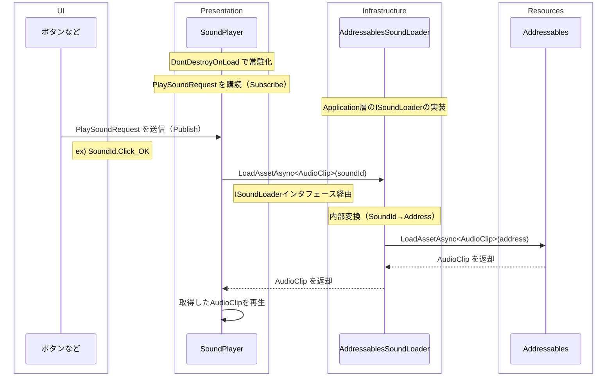
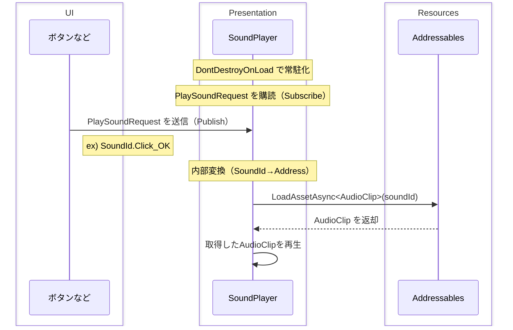

次の開発に流用できそうなものが出来たと思ったので覚え書き。

## 実現したかったこと

- 効果音（SE）の再生に関する機能（音量調整など）を一元管理すること。
  - `AudioSource`の`Play()`、`PlayOneShot()` 等の再生処理を複数個所にハードコードすると、音量調整などが大変になる。
- シーン切り替え時に効果音が途切れないこと。

## 環境

- Unity 6000.1.14f1
- MessagePipe
  - 効果音の再生リクエストの送受信に使用しました。
- VContainer
  - MessagePipe が使用できる DI コンテナなら何でもいいと思います。

## 処理イメージ



## 具体的な実装

実装するクラスは以下のとおりです。

- `PlaySoundRequest`クラス
  - MessagePipe で送受信するメッセージクラスです。
    - 今回は「 `PresentationEvent` 」というマーカークラスを継承させました。お好みで。
  - 再生したい効果音の一意 Id（ここでは `SoundId` と定義）を保持します。
  - イミュータブルだと嬉しい。
    - 今回は `record` で定義しましたが、`readonly struct` などでも代替可能のはずです。お好みで。
- `ISoundLoader` インタフェース、及びその実装である `AddressablesSoundLoader` クラス
  - 指定された効果音（AudioClip）を読み込みます。
  - 再生はしません。
- `SoundPlayer`クラス
  - MonoBehaviour を継承します。
  - DontDestroyOnLoad 下に常駐させます。
    - シーン横断時に再生した音が途切れないようにするためです。
  - `PlaySoundRequest`を購読（Subscribe）します。
    - 指定された `SoundId` を元に `ISoundLoader` から AudioClip を読み込み、再生します。
- ボタンなど
  - 効果音を再生したいタイミングで、`PlaySoundRequest`を送信（Publish）します。

### PlaySoundRequest クラス

再生する効果音を指定して送信するメッセージです。

```csharp
namespace MyGame.Presentation.Events
{
    public record PlaySoundRequest : PresentationEvent
    {
        public SoundId SoundId { get; init; }
    }
}
```

`PresentationEvent`はマーカー用の基底クラスであり、特に機能は持たせていません。

```csharp
namespace MyGame.Presentation.Events
{
    public abstract record PresentationEvent
    {
        // 特になし
        // 必要であれば「送信元」「送信日時」などの共通プロパティを実装してもよさそう。
    }
}
```

`SoundId`は効果音の列挙型です。
ここでは Addressables のアドレス等は定義していません。
（Addressables しか使わないと決めてシンプルな作りにするなら、ここで定義してもいいと思います。）

```csharp
namespace MyGame.Application
{
    public enum SoundId
    {
        Click_OK,
        Click_Cancel,
        ...
    }
}
```

### ISoundLoader インタフェース、AddressablesSoundLoader クラス

Addressables から効果音の AudioClip を読み込んで返却します。
ここでは再生はしません。

```csharp
namespace MyGame.Application
{
    public interface ISoundLoader : IDisposable
    {
        UniTask<AudioClip> LoadAudioClipAsync(SoundId soundId, CancellationToken cancellationToken = default);
    }
}
```

```csharp
namespace MyGame.Infra
{
    public class AddressablesSoundLoader : ISoundLoader
    {
        private static readonly Dictionary<SoundId, string> _address = new()
        {
            // SoundId列挙型とAddressablesのアドレスをマッピングします。
            [SoundId.Click_OK] = "Sounds/Click_OK",
            [SoundId.Click_Cancel] = "Sounds/Click_Cancel",
            ...
        };

        private readonly Dictionary<SoundId, AudioClip> _cache = new();

        public async UniTask<AudioClip> LoadAudioClipAsync(SoundId soundId, CancellationToken cancellationToken = default)
        {
            if(_cache.TryGetValue(soundId, out var cached))
                return cached;

            // SoundIdをAddressに変換
            var address = _address[soundId];

            // AddressablesからAudioClipを取得
            var audioClip = await Addressables.LoadAssetAsync<AudioClip>(address)
                .ToUniTask(cancellationToken: cancellationToken);

            // キャッシュ
            _cache[soundId] = audioClip;

            return audioClip;
        }

        public void Dispose()
        {
            foreach (var clip in _cache.Values)
            {
                if (clip != null) Addressables.Release(clip);
            }
            _cache.Clear();
        }
    }
}
```

### SoundPlayer クラス

実際に AudioClip を再生するクラスです。

```csharp
namespace MyGame.Presentation
{
    public class SoundPlayer : ... // MonoBehaviourを継承
    {
        // イベント購読
        [Inject] private ISubscriber<PlaySoundRequest> _playSoundRequest = default!;

        [Inject] private ISoundLoader _soundLoader = default!;

        // 再生した効果音（AudioSource）を管理するプール
        private ObjectPool<AudioSource> _audioSourcePool = default!;

        private void Awake()
        {
            // ...検証など（割愛）...

            // プールを初期化
            _audioSourcePool = new ObjectPool<AudioSource>(
                createFunc: () =>
                {
                    var go = new GameObject("Pooled Audio Source");
                    var item = go.AddComponent<AudioSource>();

                    // 初期設定
                    item.playOnAwake = false;

                    // 自身のライフサイクルに合わせる
                    go.transform.SetParent(transform);

                    return item;
                },
                actionOnGet: item =>
                {
                    item.gameObject.SetActive(true);
                },
                actionOnRelease: item =>
                {
                    // オブジェクトをリセット
                    item.Stop();
                    item.clip = null;
                    item.gameObject.SetActive(false);
                },
                actionOnDestroy: item =>
                {
                    if (item != null && item.gameObject != null)
                    {
                        try
                        {
                            Destroy(item.gameObject);
                        }
                        catch (MissingReferenceException)
                        {
                            // 破棄済みの場合は無視
                        }
                    }
                },
                collectionCheck: true,
                defaultCapacity: 10,
                maxSize: 30
            );

            // イベント購読
            _playSoundRequest?.Subscribe(e =>
            {
                // 再生
                _OnSoundPlayRequested(e).Forget();
            }).AddTo(this);
        }

        private void OnDestroy()
        {
            _audioSourcePool?.Clear();
            _audioSourcePool?.Dispose();
        }

        private async UniTask _OnSoundPlayRequested(PlaySoundRequest e)
        {
            var audioSource = _audioSourcePool.Get();
            try
            {
                // AudioClipを読み込み
                audioSource.clip = await _soundLoader.LoadAudioClipAsync(e.SoundId, _cancellationTokenSource.Token);

                // 必要であればここで音量調整など

                // 再生
                await audioSource.PlayAsync(_cancellationTokenSource.Token);
            }
            finally
            {
                // 返却
                if (audioSource != null && _audioSourcePool != null)
                {
                    _audioSourcePool.Release(audioSource);
                }
            }
        }
    }
}
```

この `SoundPlayer` クラス（MonoBehaviour コンポーネント）を DontDestroyOnLoad 下に常駐させます。

```csharp
// VContainerでの例
builder.RegisterComponentOnNewGameObject<SoundPlayer>(Lifetime.Singleton)
    .DontDestroyOnLoad();
```

### ボタンなど

効果音を再生したい時に `PlaySoundRequest` を送信します。

```csharp
namespace MyGame.Presentation
{
    public class SampleButton : ...
    {
        [SerializeField] private Button _button;
        ...
        [Inject] private IPublisher<PlaySoundRequest> _playSoundRequest = default!;

        private void Awake()
        {
            ...

            // UIイベントハンドラ
            // （R3を使用した例です。標準のOnClickでも可）
            _button.OnClickAsObservable().Subscribe(async _ =>
            {
                ...
                // サウンド再生
                _playSoundRequest?.Publish(new PlaySoundRequest
                {
                    SoundId = SoundId.Click_OK
                });
                ...
            }).AddTo(this);
        }
        ...
    }
}
```

こうすることで、

1. ボタンがクリックされる
2. PlaySoundRequest が送信される
3. SoundPlayer がそれを受信し、対応する AudioClip を再生する

という流れになりました。

## 疑問・未検証

同時に 10,000 個の効果音再生が重複してもちゃんと再生されるだろうか？（それが必要なケースを想定していないので検証していません）

## 所感など

改善点などあればブラッシュアップしていきたいです。
あと、BGM も似たような仕組みを構築しておくと楽そうだなと思いました。

## 余談

`ISoundLoader` を経由する（Addressables へのアクセスを外部化する）のが冗長だと感じる場合は、`SoundPlayer`内で Addressables の AudioClip 読み込み → 再生、としてもいいと思います。お好みで。


