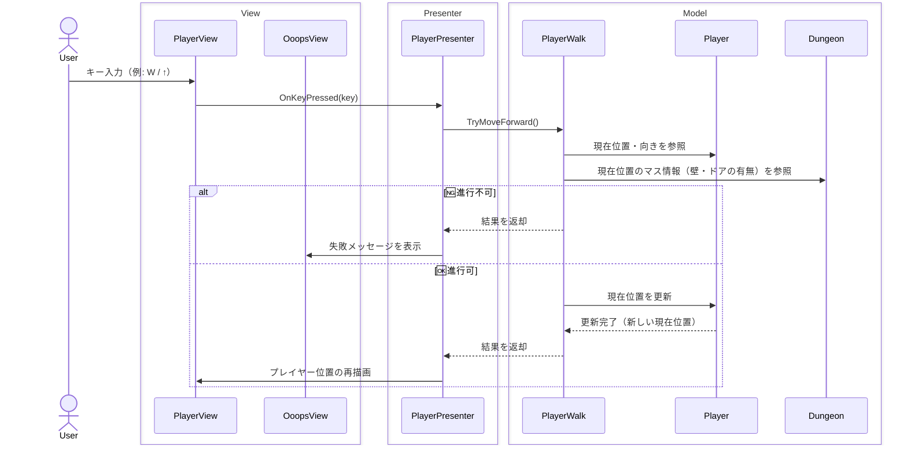

## なにこれ

3D の迷路です。

- 開発した時期
  - 2020 年頃
- 実行環境
  - unityroom
    - <https://unityroom.com/games/ushibutatory-maze>

## 使用ライブラリなど

※アーキテクチャに関するもののみ記載

- UniTask
  - 非同期処理
- UniRx
  - Rx ライブラリ
- Extenject（Zenject）
  - DI コンテナ
- YamlDotNet for Unity
  - ダンジョンのマップデータを yaml で管理していたので、その読み込み用。

## アーキテクチャ

MVP パターンで作ってみました。


## 設計・実装上のポイント

### Model ⇔ Presenter ⇔ View

実装したモデルは以下のとおりです。

- `Player`
  - 以下の状態を持ちます。
    - 「現在位置」
    - 「現在向いている方角」
  - 以下の操作を提供します。
    - 前進（＝「現在位置」の更新）
    - 右を向く、左を向く、後ろを向く（＝「現在向いている方角」の更新）
- `Dungeon`
  - 以下の状態を持ちます。
    - すべてのマス目のコレクション
      - マス目とは、「位置」「壁の有無」「ドアの有無」などを持つ構造体です。
  - 以下の操作を提供します。
    - 指定した位置のマス目情報を返す。
- `PlayerWalk`
  - 以下の状態を持ちます。
    - `Player`
    - `Dungeon`
  - 以下の操作を提供します。
    - 前進を試みる。
      - `Player` の位置・向きと、 `Dungeon` の当該位置の壁やドアの有無を照らし合わせて判定します。

キー操作をもとに Presenter クラスがこれらのモデルを参照或いは更新し、その結果を 各 View に反映しています。



後述しますが、色々と課題が多いつくりでした。

### ダンジョンデータを YAML で管理する

1 マス分のデータを以下のように定義しました。

```yaml
Grids:
  - Grid:
      X: (int)
      Y: (int)
    Wall:
      North: (boolean)
      East: (boolean)
      West: (boolean)
      South: (boolean)
    Door:
      North: (boolean)
      East: (boolean)
      West: (boolean)
      South: (boolean)
    Message:
      North: (string)
      East: (string)
      West: (string)
      South: (string)
  - Grid: ...
```

「1 行につき 1 項目」を担保しようとして YAML を採用したら、こうなりました。
もう想像つくと思いますが、10\*10 のマス目を表現しようとすると 1,800 行になります。

本腰を入れて開発するなら、このマップデータをビジュアル的に編集し YAML ファイルを出力する補助ツールと作るとよいと思います。今回はマップが 1 種類固定だったので、「手書きのコスト」と「ツール開発のコスト」を天秤にかけて手書きを選択しました。

## 所感

当時は精一杯頑張ったので達成感みたいなものはありましたが、振り返るとあまり良い設計とは言えません。

- UniRx を使った状態の同期を「View⇔Presenter」「Presenter⇔Model」の双方向で行ったため、混乱が生じたように思います。Rx での監視は結合が密になるため、参照関係の整理が大変でした。
- 各レイヤーとそのコンポーネントの責務があやふやになっている印象があります。実際、当時の作業を思い返すと、機能を追加する際にどのクラスに書けばいいのか？　悩むことが多かったように思います。
- 特に Presenter の粒度が非常に曖昧です。このゲームでは `PlayerPresenter` 、 `DungeonPresenter` の 2 つを定義しましたが、これは一体何の単位で分けられたものなのか、当時の私は説明できません。この「どういう粒度・単位で設計すればいいか明確でない」「分割・統合の境界線を正確に言語化できていない」という状態で開発していたのが、苦戦した大きな原因だったように思います。

色々と反省の多いプロジェクトでした。
