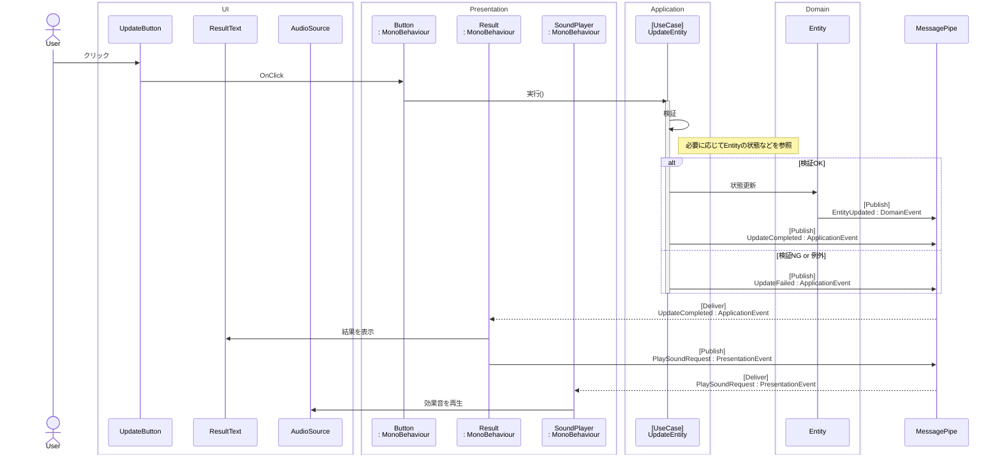
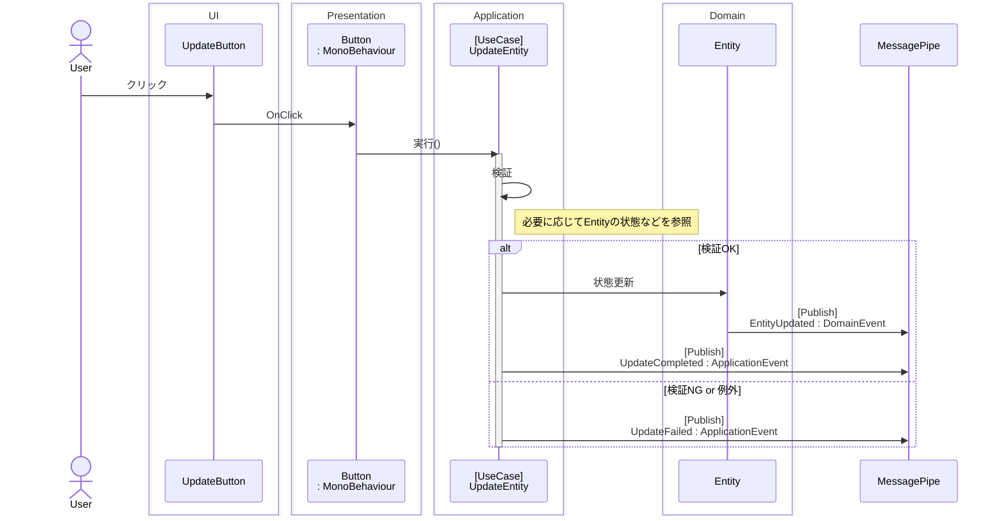
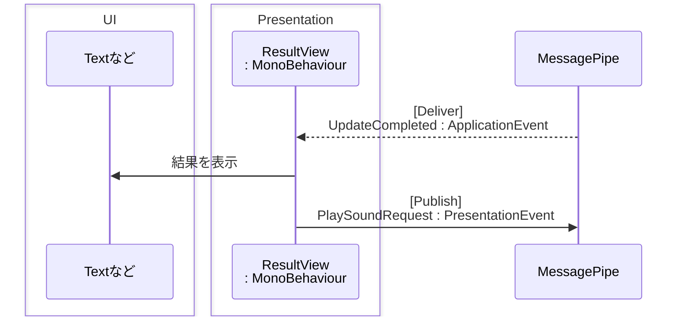
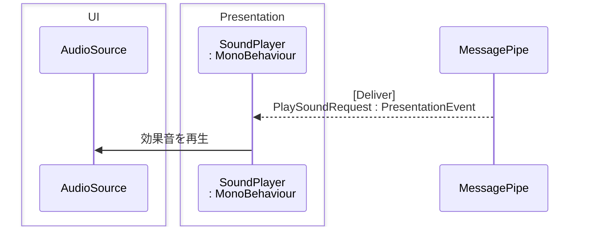

レイヤー間の通信、及びオブジェクト間の通信には MessagePipe を使った Pub/Sub パターンを適用しました。

## イベントの種類

### 1. ドメインイベント（DomainEvent）

- **責務**

  - ドメイン層で発生した「確定した事実」「状態変化の結果」を通知します。

- **命名規則**

  - 過去形（-ed）

- **例**

  - `LineRemoved` ... 星座線が削除された
  - `PaletteCreated` ... パレットが新規作成された

    ```csharp
    namespace StellaGenerator.Domain.Events
    {
        /// <summary>
        /// ドメインイベント：パレットが作成された
        /// </summary>
        public record PaletteCreated : DomainEvent
        {
            public PaletteId PaletteId { get; init; }
        }
    }
    ```

- **Pub/Sub**

  - 主にエンティティの状態更新時に Publish します。
  - 実を言うと、今回のゲーム開発ではどこからも Subscribe していません。
    - 後述の「アプリケーションイベント」で事足りてしまったからです。
    - 本来ならどのような処理が Subscribe するのか？
      - 例えば「自動セーブ機能」などがあればこれらのドメインイベントを監視して随時外部ファイルに保存する、といった用途があるかもしれません。
    - 今回は「定義したけど使わなかった」という結果になりました。

---

### 2. アプリケーションイベント（ApplicationEvent）

- **責務**

  - ユースケースの実行結果（正常終了・異常終了）を通知します。

- **命名規則**

  - 正常終了：`-Completed`
  - 異常終了：`-Failed`

- **例**

  - `LineCreationCompleted` ... 星座線作成が正常終了した
  - `LineDeletionFailed` ... 星座線削除が異常終了した

    ```csharp
    namespace StellaGenerator.Application.Events
    {
        /// <summary>
        /// アプリケーションイベント：星座線作成が正常終了した
        /// </summary>
        public record LineCreationCompleted : ApplicationEvent
        {
            public LineDTO LineDTO { get; init; }
        }
    }
    ```

- **Pub/Sub**

  - アプリケーション層のユースケース内で Publish します。
  - プレゼンテーション層の各コンポーネントが Subscribe します。

---

### 3. プレゼンテーションイベント（PresentationEvent）

- **責務**

  - 他コンポーネントへ処理を要求します。

- **命名規則**

  - `-Request`

- **例**

  - `PlaySoundRequest` ... 効果音の再生を要求する
  - `OpenDialogRequest` ... ダイアログ表示を要求する

    ```csharp
    namespace StellaGenerator.Presentation.Events.System
    {
        /// <summary>
        /// プレゼンテーションイベント: 効果音を再生を要求する
        /// </summary>
        public record PlaySoundRequest : PresentationEvent
        {
            public SoundId SoundId { get; init; }
        }
    }
    ```

- **Pub/Sub**

  - プレゼンテーション層の各コンポーネントが Publish します。
  - プレゼンテーション層の各コンポーネントが Subscribe します。
    - つまり、相互に疎に通信します。

## イベント送受信のイメージ

例）

1. ボタンがクリックされたら、
2. エンティティを更新し、
3. 処理結果をテキストに表示しつつ、
4. 効果音を再生する。

処理の流れは以下の通りです。



それぞれ見ていきます。

まずは「1. ボタンがクリックされたら」「2. エンティティを更新し」までの処理は以下の通り。



ボタンクリック時の処理は、「更新する」までで完了します。
ボタンはその結果を受け取りません（ユースケースからの戻り値もありません）。

次に、「3. 処理結果をテキストに表示」します。
結果表示用のテキストが、処理結果を受信します。



失敗時（UpdateFailed）も同様に処理します。

結果表示コンポーネント内では効果音の再生（AudioSource.Play）は実行しません。
必要なタイミングでプレゼンテーションイベント（PlaySoundRequest）を Publish するだけです。

最後に「4. 効果音を再生」します。
効果音再生は別のコンポーネント（SoundPlayer）が行います。



## 何が嬉しいのか？

以下のような実装に対応しやすくなります。

- エンティティの更新時に、複数のコンポーネントを更新したい。
  - ユースケースの開始と終了が 1:n
- 複数箇所からエンティティを更新し、都度その結果を画面に反映させたい。
  - ユースケースの開始と終了が n:1
- 複数箇所からエンティティを更新し、都度その結果を複数のコンポーネントに反映させたい。
  - ユースケースの開始と終了が n:n

こういった実装（及び実装の変更）に対して、ユースケースの開始処理と終了処理を疎結合にすることは効果があります。

## 所感

ドメインイベントを活用する箇所はありませんでしたが、機能追加や調査もしやすかったので、良かったです。
