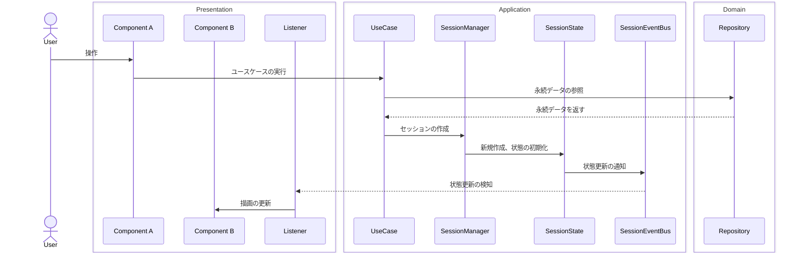
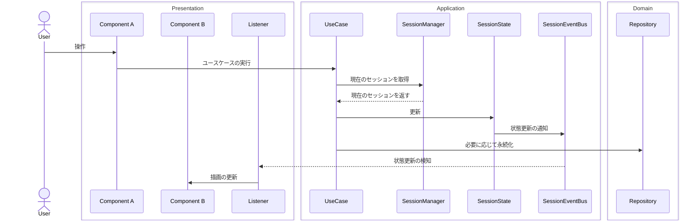
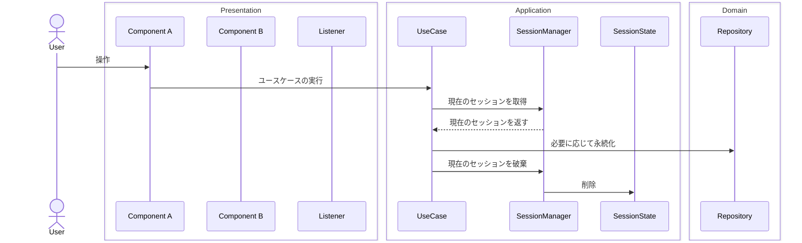

ゲーム進行中の特定の期間、状態を保持したい場合に、その管理単位を「セッション」と定義しました。

- 例）
  - プロファイル作成シーンが表示されてから、作成が完了する、または作成をキャンセルするまで
  - プロファイルが選択されてから、ゲームが終了する、または別のプロファイルが再選択されるまで
  - インゲームが始まってから、終わるまで

セッションのライフサイクルがシーン依存なのかUI切り替え依存なのかといった意識は持ちません。

## イメージ

セッション開始時の例



セッション状態の更新



セッションの終了（破棄）



## 詳細

状態を管理する `SessionState` と、生成と破棄を管理する `SessionManager` とで表現しました。
（`Session`というクラスはありません）

### SessionState

セッションが保持するデータ（状態）です。
具体的には、エンティティのインスタンスなどを保持します。

操作はすべてユースケースから行われます。

状態の更新は、`R3`、あるいは _SessionEvent_ で外部に通知します。

::: details コード

```csharp
namespace WordPuzzle.Application.InGame
{
    public interface IInGameSessionState : ISessionState
    {
        IField Field { get; }
        IHand Hand { get; }

        ReadOnlyReactiveProperty<IScoreResult> CurrentScore { get; }
        ...

        internal FieldState FieldState { get; }
        internal HandState HandState { get; }
        internal ScoreState ScoreState { get; }
        ...
    }
}

namespace WordPuzzle.Application.InGame
{
    public class InGameSessionState : SessionState<InGameSessionState>, IInGameSessionState
    {
        [Inject] private readonly FieldState _fieldState = default!;
        [Inject] private readonly HandState _handState = default!;
        [Inject] private readonly ScoreState _scoreState = default!;
        ...

        public IField Field => _fieldState.Field;
        public IHand Hand => _handState.CurrentHand;
        public ReadOnlyReactiveProperty<IScoreResult> CurrentScore => _scoreState.CurrentScore;
        ...

        FieldState IInGameSessionState.FieldState => _fieldState;
        HandState IInGameSessionState.HandState => _handState;
        ScoreState IInGameSessionState.ScoreState => _scoreState;
        ...

        public override void Dispose()
        {
            _fieldState?.Dispose();
            _handState?.Dispose();
            _scoreState?.Dispose();
            ...

            base.Dispose();
        }

        internal void Initialize(InGameSessionContext context)
        {
            _logger?.LogDebug($"{nameof(Initialize)} ...");

            // フィールドの初期化
            _fieldState.Initialize(context);

            // 手札の初期化
            _handState.Initialize(context);

            // 得点の初期化
            _scoreState.Initialize(context);

            ...

            IsInitialized = true;

            _logger?.LogDebug($"{nameof(Initialize)} ... Done.");
        }
    }
}

namespace WordPuzzle.Application.InGame.States
{
    /// <summary>
    /// 手札の状態
    /// </summary>
    public class HandState : State<HandState>
    {
        [Inject] private readonly IPublisher<HandUpdated> _handUpdated = default!;

        private Hand _currentHand = default!;
        public Hand CurrentHand => _currentHand;

        public override void Dispose()
        {
            ...
        }

        internal void Initialize(InGameSessionContext context)
        {
            _logger?.LogDebug($"{nameof(Initialize)} ...");

            // 初期化
            InitializeHand();

            _logger?.LogDebug($"{nameof(Initialize)} ... Done.");
        }

        /// <summary>
        /// 手札を初期化します。
        /// </summary>
        internal void InitializeHand() => InitializeHand(Hand.Empty());

        internal void InitializeHand(Hand newHand)
        {
            _logger?.LogDebug($"{nameof(InitializeHand)} ... : {nameof(Hand)} = {newHand}");

            // 手札のリセット
            _currentHand = newHand;

            // 通知
            _logger?.LogDebug($"Publishing [{nameof(HandUpdated)}] : Reason = {HandUpdated.ReasonType.Initialized}");
            _handUpdated.Publish(new HandUpdated
            {
                Reason = HandUpdated.ReasonType.Initialized,
                Hand = _currentHand,
                CardIds = _currentHand.Cards.Select(c => c.Id).ToArray()
            });
        }

        /// <summary>
        /// 手札を破棄します。
        /// </summary>
        internal void TrashHand()
        {
            _logger?.LogDebug($"{nameof(TrashHand)} ...");

            var trashedCards = _currentHand.Cards.Select(c => c.Id).ToArray();

            // 手札のリセット
            _currentHand = Hand.Empty();

            // 通知
            _logger?.LogDebug($"Publishing [{nameof(HandUpdated)}] : Reason = {HandUpdated.ReasonType.CardTrashed}");
            _handUpdated.Publish(new HandUpdated
            {
                Reason = HandUpdated.ReasonType.CardTrashed,
                Hand = _currentHand,
                CardIds = trashedCards
            });
        }

        /// <summary>
        /// 手札にカードを追加します。
        /// </summary>
        internal void AddCardToHand(ICard card)
        {
            _logger?.LogDebug($"{nameof(AddCardToHand)} ... : {nameof(CardId)} = {card.Id}, {nameof(ICard)} = {card.CardKey}");

            // 手札にカードを追加
            _currentHand.Append(card);

            // 通知
            _logger?.LogDebug($"Publishing [{nameof(HandUpdated)}] : Reason = {HandUpdated.ReasonType.CardAdded}");
            _handUpdated.Publish(new HandUpdated
            {
                Reason = HandUpdated.ReasonType.CardAdded,
                Hand = _currentHand,
                CardIds = new[] { card.Id }
            });
        }

        /// <summary>
        /// 手札からカードを取り除きます。
        /// 取り除いたカードリストを返します。
        /// </summary>
        internal IReadOnlyList<ICard> RemoveCardFromHand(CardId cardId)
        {
            _logger?.LogDebug($"{nameof(RemoveCardFromHand)} ... : {nameof(CardId)} = {cardId}");

            // 手札からカードを取り除く
            var removed = _currentHand.RemoveFrom(cardId);

            if (removed.Count > 0)
            {
                // 通知
                _logger?.LogDebug($"Publishing [{nameof(HandUpdated)}] : {nameof(HandUpdated.ReasonType)} = {HandUpdated.ReasonType.CardRemoved}");
                _handUpdated.Publish(new HandUpdated
                {
                    Reason = HandUpdated.ReasonType.CardRemoved,
                    Hand = _currentHand,
                    CardIds = removed.Select(c => c.Id).ToArray()
                });
            }

            return removed;
        }
        ...
    }
}
```

必要に応じて、子クラスに分割します。
（上記の例では、`FieldState`や`HandState`などに分割しています。）

:::

### SessionManager

セッション状態を生成・破棄します。

操作は `internal` とし、アプリケーション層内（ユースケース）からのみ操作可能とします。

::: details コード

```csharp
namespace WordPuzzle.Application.InGame
{
    public interface IInGameSessionManager : ISessionManager
    {
        IInGameSessionState Current { get; }

        internal void Initialize(InGameSessionContext context);
    }
}

namespace WordPuzzle.Application.InGame
{
    public class InGameSessionManager : SessionManager<InGameSessionManager>, IInGameSessionManager
    {
        [Inject] private readonly InGameSessionState _state = default!;

        public IInGameSessionState Current => _state;

        public void Dispose()
        {
            _state?.Dispose();
        }

        void IInGameSessionManager.Initialize(InGameSessionContext context)
        {
            _state.Initialize(context);
        }
    }
}
```

`-SessionContext`は、セッションを初期化する際に使用するパラメータの集合です。

```csharp
namespace WordPuzzle.Application.InGame
{
    public readonly record struct InGameSessionContext
    {
        public required FieldId FieldId { get; init; }
        public required Field Field { get; init; }

        public CardDeck<INounCardDefinition, INounCard> NounDeck { get; init; }
        public CardDeck<IVerbCardDefinition, IVerbCard> VerbDeck { get; init; }
        ...
    }
}
```

:::

## 所感

管理する状態が増えると複雑になっていくので、もっとシンプルな管理方法で認知負荷を下げられないか考えていきたいです。
