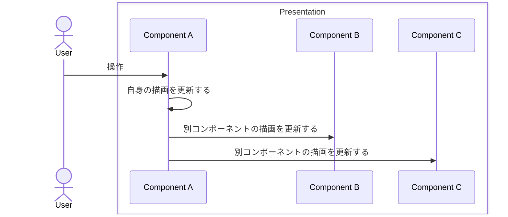
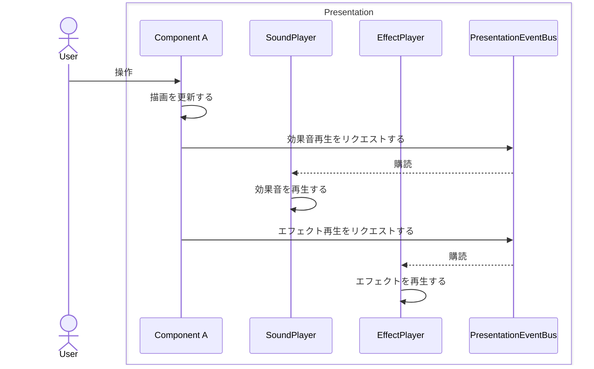
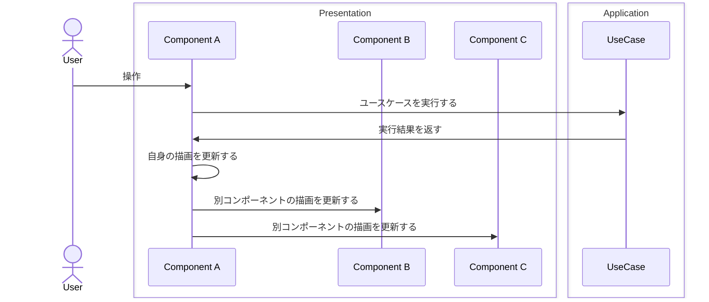
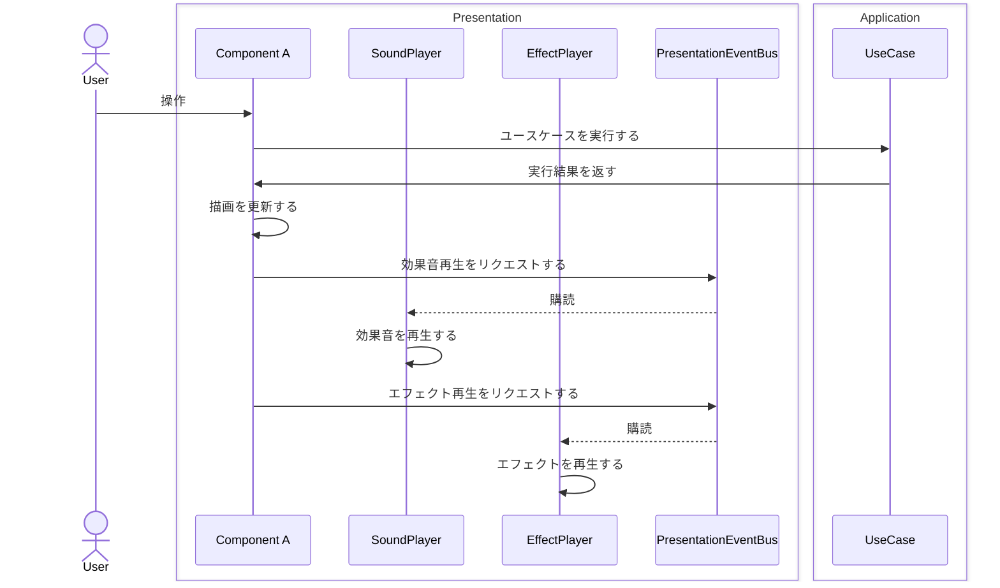
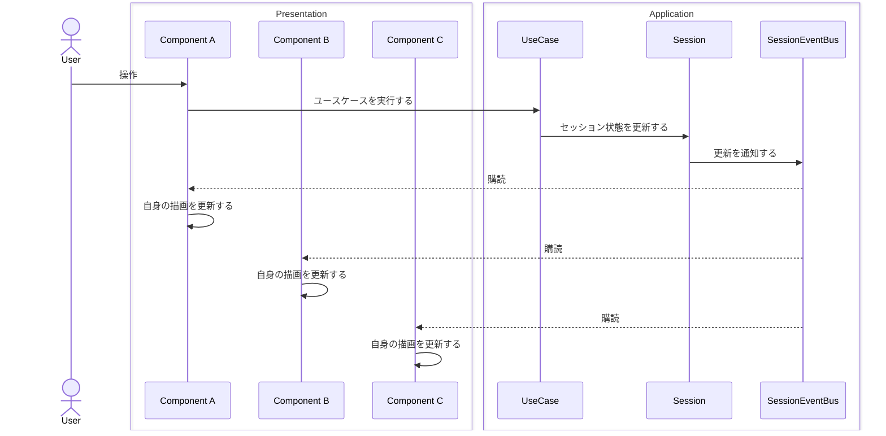

プレゼンテーション層のコンポーネント（ボタンやカード）が別のコンポーネントを操作したり描画を変更したりしたい場合は、以下のような方法になります。

### ユースケースを実行しない場合

最もシンプルな操作です。

プレゼンテーションイベントを使ってリクエストする場合は以下のようになります。

### ユースケースを実行する場合

いくつかのパターンで実装できます。

自身が管理する別コンポーネントを直接操作する場合は以下のようになります。

他コンポーネントへのリクエストを送る場合は以下のようになります。

各コンポーネントがセッション状態の更新を購読する場合は以下のようになります。

例）

- ユースケース「手札を提出する」を実行した後、手札コンポーネント内にカードコンポーネントを移動させる、スコアUIを更新する
