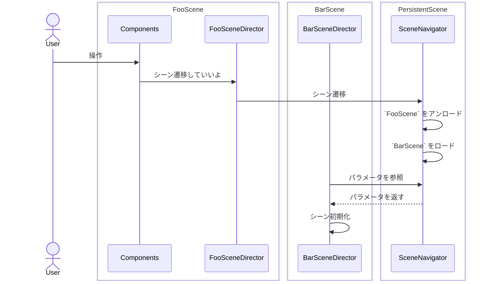

みんな大好き、オレオレシーン管理です。


## 構成

### SceneNavigator

シーンのロードとアンロードを管理します。

`MonoBehaviour`は継承せず、[永続シーン（`PersistentScene`）](./presentation-persistent)の _LifetimeScope_ に `Singleton` で登録します。

[以前](https://zenn.dev/ushibutatory/books/ushibutatory-gamedev-4/viewer/6-scene)は、スタック形式でシーン戻りなどしていましたが、今回はシンプルにしました。

::: details コード

```csharp
namespace WordPuzzle.Presentation.Scenes
{
    public class SceneNavigator
    {
        private SceneId? _currentSceneId = null;
        private ISceneParameter? _currentParameter;

        public async UniTask LoadAsync(SceneId sceneId, ISceneParameter? parameter = null)
        {
            _currentSceneId = sceneId;
            _currentParameter = parameter;

            // 不要になったシーンをアンロード
            await _UnloadScenesAsync();

            // 新しいシーンをロード
            await SceneManager.LoadSceneAsync(sceneId.ToSceneName(), LoadSceneMode.Additive).ToUniTask();

            // 新しいシーンをアクティブに設定
            Scene newScene = SceneManager.GetSceneByName(sceneId.ToSceneName());
            SceneManager.SetActiveScene(newScene);

            // フレーム待機（ロードとアクティブ化の確定を待つ）
            await UniTask.DelayFrame(3, PlayerLoopTiming.Update);
        }

        public TParameter? GetParameter<TParameter>()
            where TParameter : class, ISceneParameter
            => _currentParameter as TParameter;

        private async UniTask _UnloadScenesAsync()
        {
            for (var i = 0; i < SceneManager.sceneCount; i++)
            {
                var scene = SceneManager.GetSceneAt(i);

                if (scene != null
                    && scene.name != SceneId.Persistent.ToSceneName()
                    && scene.name != _currentSceneId?.ToSceneName())
                {
                    await SceneManager.UnloadSceneAsync(scene.name).ToUniTask();
                }
            }
        }
    }
}
```

:::

### シーンごとのSceneDirector

そのシーンの初期化と全体の進行を管理します。

- シーン遷移してきた時の初期表示
- 他シーンへの遷移指示

`MonoBehaviour`を継承せず、`VContainer.Unity.IPostStartable` を実装した上で `EntryPoint` に登録します。

::: details コード

```csharp
namespace WordPuzzle.Presentation.Abstractions
{
    public abstract class SceneDirector<T> : SceneDirector, IStartable, IPostStartable, IDisposable
        where T : SceneDirector<T>
    {
        protected CompositeDisposable _disposables = default!;

        void IStartable.Start()
        {
            _disposables = new CompositeDisposable();
            _SetupSubscribes();
        }
        protected abstract void _SetupSubscribes();

        async void IPostStartable.PostStart()
        {
            ...
            await _OnSceneReadyAsync();
            ...
        }
        protected abstract UniTask _OnSceneReadyAsync();

        public virtual void Dispose()
        {
            _disposables?.Dispose();
            _disposables = null!;
        }
    }
}

namespace WordPuzzle.Presentation.Scenes.InGame
{
    public class InGameSceneDirector : SceneDirector<InGameSceneDirector>
    {
        [Inject] private readonly ApplicationDependencies _application = default!;
        public class ApplicationDependencies
        {
            // Session
            [Inject] public readonly IInGameSessionManager InGameSession = default!;

            // UseCases
            [Inject] public readonly IStartInGame StartGame = default!;
            [Inject] public readonly ISupplyCard SupplyCard = default!;
            ...

            // Events
            [Inject] public readonly ISubscriber<InGameEnded> InGameEnded = default!;
        }

        [Inject] private readonly PresentationDependencies _presentation = default!;
        public class PresentationDependencies
        {
            // UI
            [Inject] public readonly InGameUINavigator UINavigator = default!;
            ...
        }

        [Inject] private readonly PersistentComponents _persistent = default!;
        public class PersistentComponents
        {
            [Inject] public readonly SceneNavigator SceneNavigator = default!;
            [Inject] public readonly AudioPlayer Audio = default!;
        }

        private InGameSceneParameter _sceneParameter = default!;

        // VContainer.Unity.IPostStartable.PostStart()で実行
        protected override async UniTask _OnSceneReadyAsync()
        {
            _sceneParameter = _persistent.SceneNavigator.GetParameter<InGameSceneParameter>()
                ?? throw new SceneParameterNotFoundException(typeof(InGameSceneParameter));

            // UI初期化
            _presentation.UINavigator.Initialize();
            _presentation.UINavigator.Show();

            // 音楽再生
            _persistent.Audio.PlayMusic(MusicId.InGame);

            // ゲーム開始
            _application.StartGame.Execute(new IStartInGame.Request
            {
                FieldId = _sceneParameter.FieldId,
            });

            // カードを補充する
            _application.SupplyCard.Execute();

            await UniTask.CompletedTask;
        }

        protected override void _SetupSubscribes()
        {
            // ゲーム終了
            _application.InGameEnded.Subscribe(async _ =>
            {
                // 結果シーンに遷移する
                await _persistent.SceneNavigator.LoadAsync(SceneId.Result, new ResultSceneParameter
                {
                    // no fields
                });
            }).AddTo(_disposables);
        }
    }
}
```

```csharp
namespace WordPuzzle.LifetimeScopes.Scenes
{
    public class InGameSceneLifetimeScope : SceneLifetimeScope
    {
        protected override void _Configure(IContainerBuilder builder, IProductSettings settings, MessagePipeOptions messagePipeOptions)
        {
            ...
            builder.RegisterEntryPoint<InGameSceneDirector>(Lifetime.Scoped);
            ...
        }
    }
}
```

:::

### シーンごとのパラメータ

シーン遷移時に渡すパラメータです。

::: details コード

```csharp
namespace WordPuzzle.Presentation.Scenes.InGame
{
    public record InGameSceneParameter : ISceneParameter
    {
        public required FieldId FieldId { get; init; }
    }
}
```

:::

シーンにパラメータを渡したくなる場面はいくつかあります。

- 前シーンで使っていたデータを次シーンでも使いたい
- シーン初期化処理の挙動を制御したい

前者の場合、取るべき手法はパラメータ渡しではなく「前シーンでデータを永続化し、次シーンで読み込む」「横断して継続するセッションを定義して状態保持する」のいずれかの方がよいと思います。

後者の場合でのみ、パラメータ渡しするようにしました。

## 処理の流れ



## 所感

「Now loading...」みたいなのは作りませんでした。次は作りたい。
