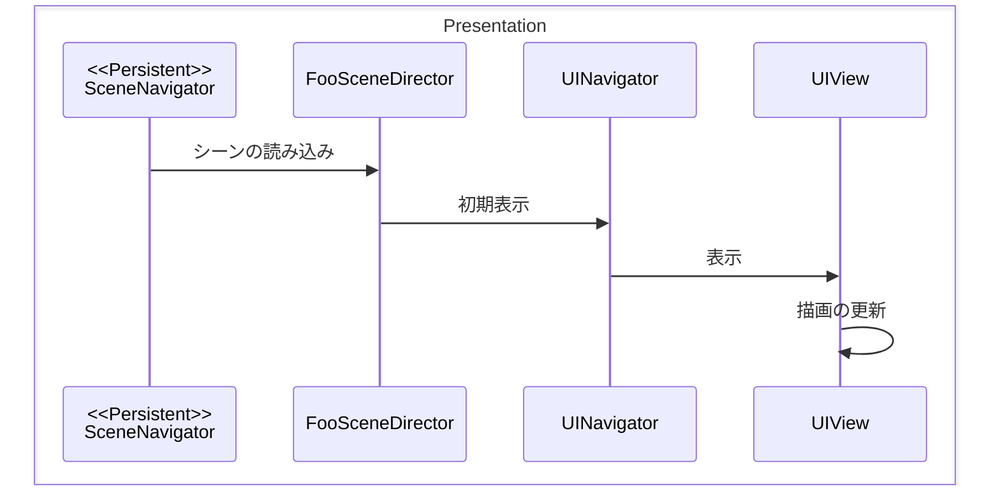
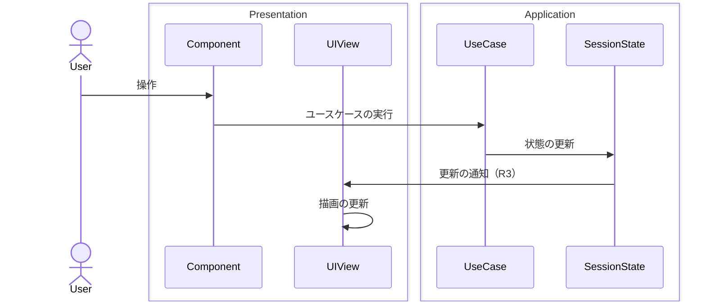
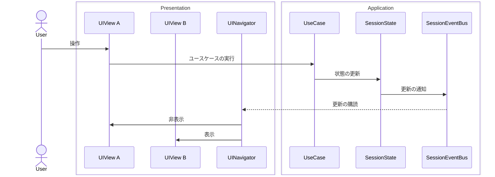

相変わらず苦手意識の強い UI Toolkit について、自分なりにこうしてみたら楽に感じた、という構成です。


_イメージ_

## 構成（C#スクリプト）


_例）InGameシーンのUI関連スクリプト_

### UIView, UIViewSection

UXMLに対応します。
複数の VisualElement を配置し、UIのまとまりを作成します。
シンプルなUIであれば `UIView` のみ、グループ化した方が管理しやすければ `UIViewSection` として部品化します。
（Sectionの分割単位とUXMLの分割単位は必ずしも一致しなくても構いませんが、一致させた方が管理はしやすいです）

UIイベント（ボタンクリック等）の購読やセッション状態の購読、描画更新を行います。

`MonoBehaviour` を継承しません。

::: details コード

```csharp
namespace WordPuzzle.Presentation.Scenes.InGame.UI
{
    public class InGameUIView : UIView<InGameUIView>
    {
        [Inject] private readonly InGameMenuSection _menuSection = default!;
        [Inject] private readonly InGameHUDSection _hudSection = default!;

        public Observable<Unit> OnSubmitClicked => _menuSection.OnSubmitClicked;
        public Observable<Unit> OnResetClicked => _menuSection.OnResetClicked;
        ...

        protected override void _Initialize(VisualElement root)
        {
            var section = root.Q<VisualElement>("section-menu");
            _menuSection.Bind(section);
            _hudSection.Bind(section);
            // ↑
            // UXMLは一つなので、同じものをそれぞれにバインドしています。なぜ直さなかったのか……？
        }
    }
}

namespace WordPuzzle.Presentation.Scenes.InGame.UI.Sections
{
    public class InGameMenuSection : UIViewSection<InGameMenuSection>
    {
        [Inject] private readonly ApplicationDependencies _application = default!;
        public class ApplicationDependencies
        {
            [Inject] public readonly IInGameSessionManager Session = default!;
        }

        private Button _submitButton = default!;
        private Button _resetButton = default!;
        ...

        private readonly Subject<Unit> _onSubmitClicked = new();
        private readonly Subject<Unit> _onResetClicked = new();
        ...

        public Observable<Unit> OnSubmitClicked => _onSubmitClicked;
        public Observable<Unit> OnResetClicked => _onResetClicked;
        ...

        protected override void _Query(VisualElement root)
        {
            _submitButton = root.Q<Button>("submit-button");
            _resetButton = root.Q<Button>("reset-button");
            ...
        }

        public override void Dispose()
        {
            _onSubmitClicked?.Dispose();
            _onResetClicked?.Dispose();
            ...
            base.Dispose();
        }

        protected override void _SetupSubscribes()
        {
            // UI
            _submitButton.OnClickAsObservable().Subscribe(_ =>
            {
                _audio.PlaySound(SoundId.ButtonClick);
                _onSubmitClicked.OnNext(Unit.Default);
            }).AddTo(_disposables);

            _resetButton.OnClickAsObservable().Subscribe(_ =>
            {
                _audio.PlaySound(SoundId.ButtonClick);
                _onResetClicked.OnNext(Unit.Default);
            }).AddTo(_disposables);
            ...

            // ↓R3でセッション状態の変化を購読しつつUI状態に反映したい場合はこんな感じ
            // Application
            _application.Session.Current.EnableReport.Subscribe(enabled =>
            {
                _reportButton.style.display = enabled
                    ? DisplayStyle.Flex
                    : DisplayStyle.None;
            }).AddTo(_disposables);
            ...
        }
    }
}
```

:::

### UINavigator

`UIView` の状態を管理します。

複数の `UIView` をまとめて、表示・非表示を指示します。
`MonoBehaviour` を継承し、シーン上のヒエラルキーに配置します。

::: details コード

```csharp
namespace WordPuzzle.Presentation.Scenes.InGame.UI
{
    public class InGameUINavigator : UINavigator<InGameUINavigator>
    {
        [SerializeField] private UIDocument _inGameUIDocument = default!;

        [Inject] private readonly InGameUIView _inGameUIView = default!;

        public void Initialize()
        {
            _inGameUIView.Bind(_inGameUIDocument.rootVisualElement);

            HideAll();
        }

        public void Show() => _inGameUIView.Show();
        public void Hide() => _inGameUIView.Hide();

        protected override void _HideAll()
        {
            Hide();
        }
    }
}
```

上記は1種類のUIの表示切り替えしかないが、複数切り替えたい場合は `Show_○○()` / `Hide_○○()`みたいなメソッド名にしていました。

:::

## 構成（Unity）

### UXML, USS

それぞれ作成します。


_例）InGameシーンのUI関連ファイル_

Unityエディタで初期作成し、詳細はVSCodeで編集する方法が私は好きです。

### UINavigatorのPrefab

`UINavigator`, `UIDocument`, 作成したUXMLを組み立てます。


※Unityエディタをバージョンアップしたら `UIDocument` ではなく `PanelRenderer` を使うよう警告が出てしまっていますが、古いままです。

## 処理の流れ

### 例）シーン遷移時にUIを初期表示する



（※ `SceneNavigator` , `SceneDirector` については [別ページ](./presentation-scene) を参照）

### 例）ユースケース実行後、更新された状態をUIに表示する



### 例）UIの表示を切り替える



## 所感

UI Toolkitについてはまだまだ経験値不足だなと思います。
